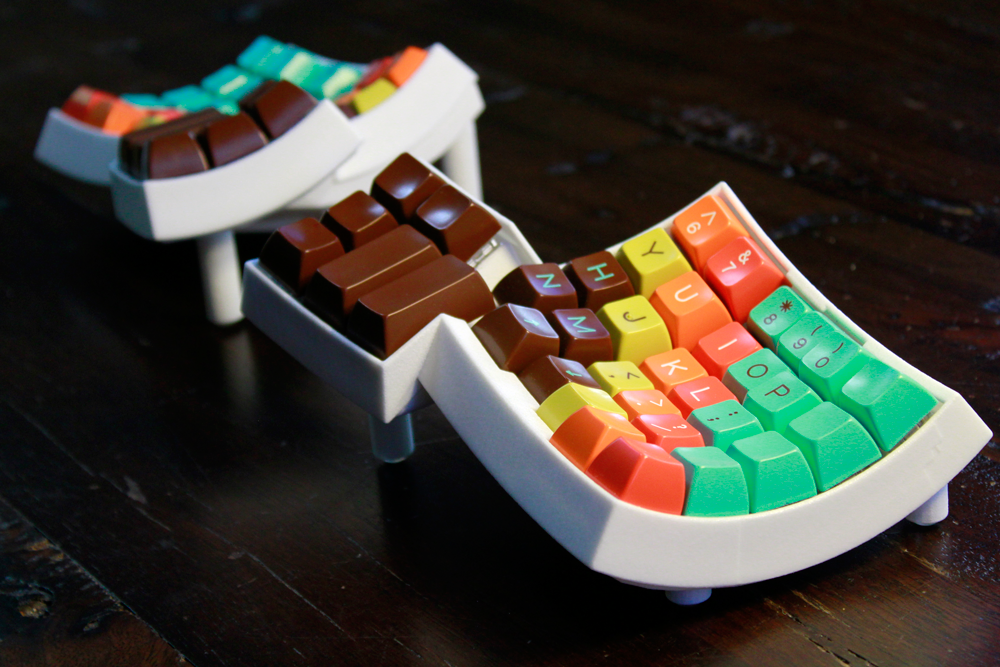
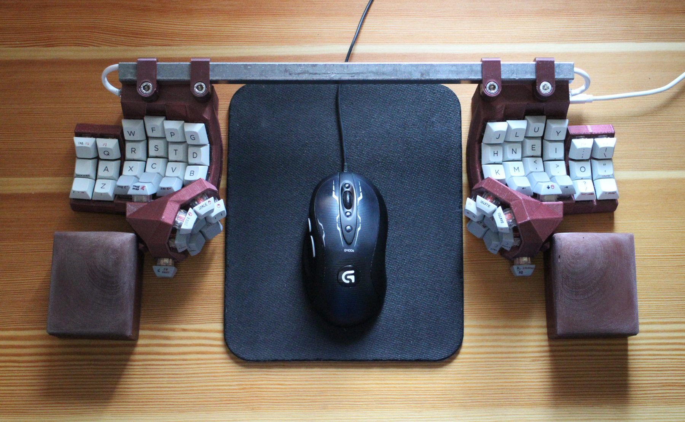
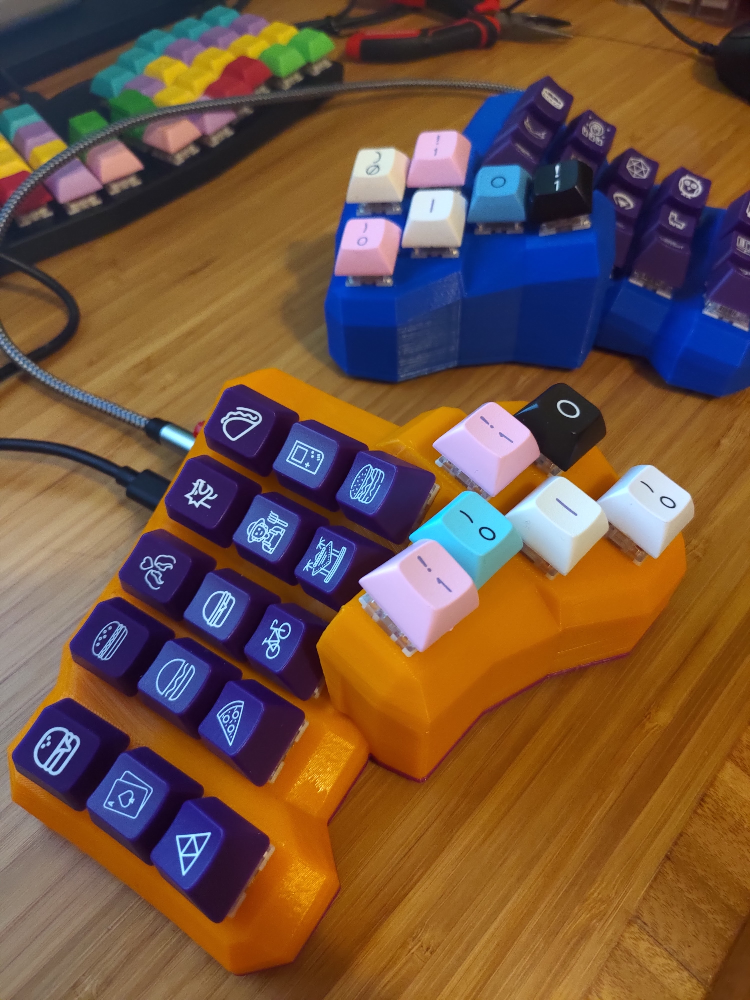
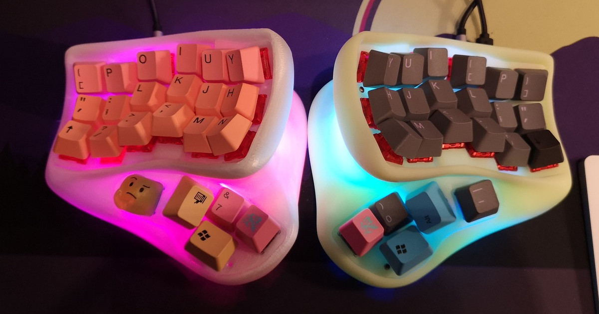

# Dactyl-Family-Album

Welcome to the Dactyl Family Album! This repository was made to serve as a place to look at all of the different designs and iterations people have made based on or inspired by the [Dactyl Keyboard](https://github.com/adereth/dactyl-keyboard). As this page is made to highlight different designs and innovations, slight modifications won't be featured in the main page, but instead be featured in the [Addendum page](./Addendum.md). If you desire to add an entry onto either the main page or addendum, feel free to open up a pull request or issue, using the templates found in the [Templates Page](./Templates.md) for new additions.

# Keyboards

## Dactyl

Created By: adereth

[Link](https://github.com/adereth/dactyl-keyboard)

[Addendum](./Addendum.md#Dactyl)

#### Keys

Columns: 0 - 6

Rows: # 0 - 5

Thumb keys: 6

#### Build

Has been built before: Yes

####  Innovation

Its the grandpappy of the whole thing, it doesn't need an introduction. The original dactyl was inspired by the Kinesis Advantage2 keyboard, just spit into two halves instead having it as one piece.

## Dactyl Manuform

Created By: [tshort]

[Link](https://github.com/tshort/dactyl-keyboard)

[Addendum](./Addendum.md#Dactyl-Manuform)

#### Keys

Columns: 4 - 6

Rows: 5 and up

Thumb keys: 6

#### Build

Has been built before: Yes

#### Innovation

This project removes the thumb cluster of the base Dactyl, replacing it with the thumb cluster of the [ManuForm Keyboard](https://github.com/jeffgran/ManuForm)

## DMOTE (Dactyl-ManuForm: Opposable Thumb Edition)

Created By: veikman

[Link](https://github.com/veikman/dactyl-keyboard)

[Addendum](./Addendum.md#DMOTE)

#### Keys

Columns: 6

Rows: 3

Thumb keys: 8

#### Build

Has been built before: Yes

####  Innovation

This project has a very unique thumb cluster, arranging all of the keys in a dome-like hex pattern, with the home key being in the center. This gives the user access to immediate access to more thumb keys in a closer proximity than other projects in addition to adding a palm key. Besides this, the project also creates its own system for defining different keyboards and layouts through the use of YAML files (a format similar to JSONs). This system is also used to create the sister "The Concertina" project, featured in the same repository.

## Dactylria

Created By: jchendy

[Link](https://github.com/jchendy/dactyl-manuform/)

#### Keys 

Columns: 5

Rows: 3

Thumb keys: 6

#### Build

Has been built before: Yes

####  Innovation

This project creates a whole new thumb cluster inspired by the Kyria and Keyboardio Model 01 according to its creator, creating in interesting arc seem more commonly on flat boards. 

# Lime40

Created By: eucalyn

[Link](https://eucalyn.fanbox.cc/)

#### Keys

Columns: 6

Rows: 3

Thumb keys: 5

#### Build

Has been built before: Yes

####  Innovation

What truly makes this project unique is its thumb cluster; unlike most other projects, the Lime40 places the thumb cluster directly underneath the key wells instead of to the side.  This causes the user to hold their hand [in a unique way](https://twitter.com/eucalyn_/status/1146534878957096960?s=20), unlike how one typically holds it for most other projects. In addition, the Lime40 has a very smooth and sculpted look to it, different from the usual blocky and hard edged look of other projects.

