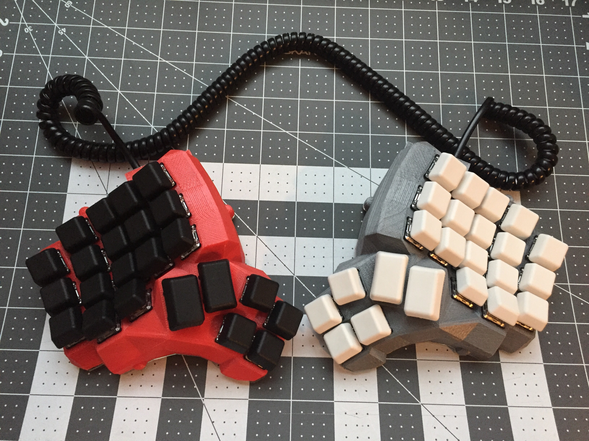

# Dactyl-Family-Album

Welcome to the Dactyl Family Album! This repository was made to serve as a place to look at all of the different designs and iterations people have made based on or inspired by the [Dactyl Keyboard](https://github.com/adereth/dactyl-keyboard). As this page is made to highlight different designs and innovations, slight modifications won't be featured in the main page, but instead be featured in the [Addendum page](./Addendum.md). If you desire to add an entry onto either the main page or addendum, feel free to open up a pull request or issue, using the templates found in the [Templates Page](./Templates.md) for new additions. 

# Keyboards

## Dactyl

Created By: adereth

[Link](https://github.com/adereth/dactyl-keyboard)

[Addendum](./Addendum.md#Dactyl)

#### Keys 

Columns: 0 - 6

Rows: # 0 - 5

Thumb keys: 6

#### Build

Has been built before: Yes

####  Innovation

Its the grandpappy of the whole thing, it doesn't need an introduction

## Dactyl Manuform

Created By: [abstracthat](https://github.com/abstracthat)  

[Link](https://github.com/abstracthat/dactyl-manuform)

[Addendum](./Addendum.md#Dactyl_Manuform)

#### Keys 

Columns: 4 - 6

Rows: 5 and up

Thumb keys: 6

#### Build

Has been built before: Yes

#### Innovation

This project removes the thumb cluster of the base Dactyl, replacing it with the thumb cluster of the [ManuForm Keyboard](https://github.com/jeffgran/ManuForm)
